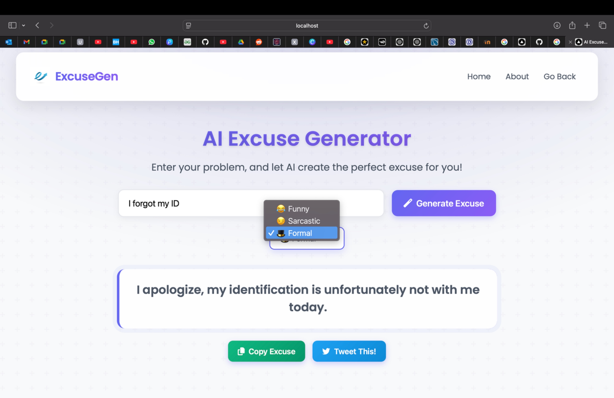

# 🎭 AI Excuse Generator

An **AI-driven excuse generation tool** that formulates creative excuses based on user input using **Natural Language Processing (NLP)**.


---

## ✨ Features

✅ **Context-Aware Tone Selection**  
- Choose from **Formal**, **Sarcastic**, or **Funny** tones for dynamic adaptability.  

✅ **AI-Powered Excuse Generation**  
- Uses **Google Gemini API** to craft personalized and unique excuses.  

✅ **Integrated Social Media Sharing**  
- Instantly share your excuse on **Twitter/X** with one click.  

✅ **Hidden Easter Eggs**  
- Gamification elements for user engagement. Try different inputs to discover them!  

✅ **Smart Emoji Suggestions**  
- **Sentiment analysis** suggests relevant emojis for a perfect excuse.  

---

## 🛠 Tech Stack

- **Backend:** Node.js, Express.js, Google Gemini API  
- **Frontend:** React.js, React-Icons  
- **API Handling:** Axios  
- **Environment Variables:** dotenv  

---

## 🎥 Demo / Mockup  




---

## 🏗 Installation & Setup

1️⃣ **Clone the Repository**  
```sh
git clone https://github.com/Kausheya2006/vlab_project.git
cd vlab_project
```
2️⃣ **Install Dependencies**
```sh
npm install
```
3️⃣ **Set Up Environment Variables**
Create a .env file in the root directory and add:
```sh
GOOGLE_GEMINI_API_KEY=your_api_key_here
```
4️⃣ **Run the App**
```sh
npm start
```
---
## 🛠 API Usage

### Generate an Excuse

**Endpoint:**
```
POST /api/generate-excuse
```
**Request Body:**
```json
{
  "context": "I forgot to submit my assignment",
  "tone": "Funny"
}
```
**Response Example:**
```json
{
  "excuse": "Oh no! My pet goldfish was watching YouTube and accidentally deleted my assignment!"
}
```

---
## 🤝 Contributing

Contributions are welcome! Feel free to fork the repo and submit a pull request.

